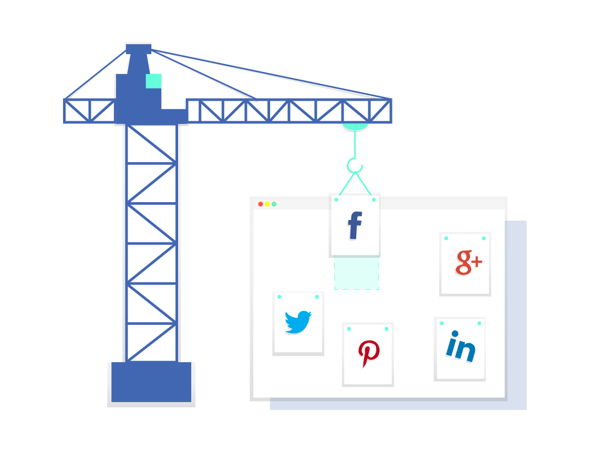

<h1 align="center">Laravel Facebook</h1>

   

<h3>But du projet</h3>

Réalisation de facebook avec laravel

<h3>Etape du projet</h3>
<h4>Création Projet avec laravel  </h4>

Création du projet avec la commande : new laravel nom du projet -auth

<h4>Création de la base de donnée

</h4>

Création de la base avec mamp puis connexion a cette base de données depuis le fichier .env.

<h4>Migration - Seeder</h4>

Création des différentes migrations pour les tables de la base de données ( table posts, users, friends)

Création des seeders pour remplir la table des users avec des vraies infos ( réaliser avec faker ) ainsi qu'une image pour chacun des users, la table des posts.

<h4>Authentification : Login / Register</h4>

Grâce à laravel, la partie authentification a été rapide à faire grace à la commande du début -auth. J'ai juste dû rajouter un champ username et mettre un champ avatar par défaut.

<h4>Interface / Fonctionnalitées</h4>

J'ai utilisé Boostrap comme framwork pour l'interface

J'ai commencé par l'interface de la page timeline. Avec un champ textera pour que les users ajoutent des posts, puis une partie pour que les posts s'affiche sur la page avec la date de création ainsi que le nom de l'user qui là écrit et son avatar ( relation entre post et user ).

Tous les pots pouront etre like une seul fois par les users

Puis j'ai fait la page welcome, qui représente la premier page du site, les users pourront se connecter directement en cliquant sur les boutons, login ou register qui se trouve sur la nav bar. Ou accéder directement a la timeline si ils sont déja connecte

Ensuite la page account, qui permet aux utilisateurs de modifier leur donnée de leur compte ( avatar, nom, username, email et mot de passe ), et aussi de supprimer leur compte

Pour, la page profil, qui permet aux users de voir leurs posts, leurs amis, mais aussi de pouvoir voir les pages de profil des autres users, et de les ajouter en amis
 
Mais leur demande devra etre validé par l'utilisateur en question.

On retrouve aussi un partie rechercher, pour chercher les utilisateur plus facilement

Ensuite, il y aura la page amis pour voir les amis des users, ainsi que leur demande en cours d'amis...

<h3>Lancer le projet</h3>

# Cloner le repo

# Lancer les migrations et seeders

# Lancer le projet avec la commande php artisan serve

